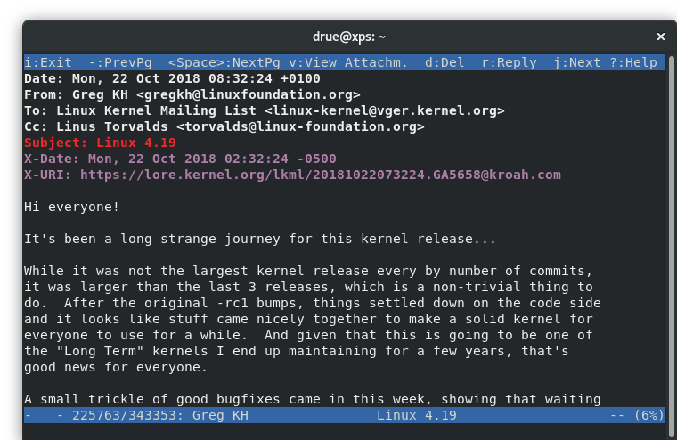

# Lorifier

[](https://github.com/ambv/black)

Lorifier is a mutt display filter that is used to add
[lore](https://www.kernel.org/lore.html) links to compatible emails, when
they're viewed in mutt. It also adds a localized date header.

This script adds the following headers:
- X-Date: Date translated to localtime
- X-URI: lore-compatible link, if available



## Installation

Copy lorifier.py to your filesystem. The rest of the files in this
repository are not necessary.

Make the following modifications to your .muttrc:

```
set display_filter="/PATH/TO/lorifier.py"
ignore *
unignore from date subject to cc x-date x-uri message-id
```

Note that if Message-ID is not unignored, mutt will not pass it to the
display_filter and the lore link will not be able to be generated. As a
consequence of this behavior, lorifier.py will subsequently remove
Message-ID from the displayed email, so that it will not be displayed.

## Requirements

lorifier.py requires python 3, and has been tested with 3.7.

## Testing

Run 'make test' or 'pytest'. Requires pytest.
